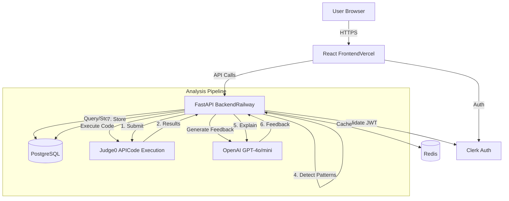

# CodeMentor AI - Project Overview Document
---

## 1. Project Goal & Core Problem

**Goal:** Enable candidates preparing for technical interviews to identify and overcome their systematic coding weaknesses through AI-powered pattern detection and personalized feedback.

**Core Problem:** Candidates solve 50-100 LeetCode problems but keep making the same mistakes (e.g., always choosing O(n²) solutions, missing edge cases for empty arrays) because existing platforms only show "Accepted" or "Wrong Answer" without analyzing *why* their approach is suboptimal. They waste time on random problems instead of targeting their actual gaps, and with only 2-3 interview attempts before 6-12 month waiting periods, inefficient practice is costly.

---

## 2. MVP Scope & Key Features

### Features IN Scope for MVP (Week 15 Demo)

**Core Features (Must Have - P1):**

1. **Code Execution Sandbox** - Submit code and execute against test cases in isolated environment (Judge0 API)
2. **Error Pattern Detection** - Classify 6 error types: missing edge cases, suboptimal complexity, wrong data structure, off-by-one errors, missing validation, inefficient loops
3. **GPT-4 Explanations** - Generate natural language feedback explaining mistakes and how to improve
4. **User Weakness Profile** - Track recurring error patterns per user across all submissions
5. **Pattern Frequency Tracking** - Count how often each error type occurs, show percentage breakdown
6. **Progress Dashboard** - Visual dashboard with weakness trend charts, solved problems count, mastery scores
7. **Personalized Problem Queue** - Recommend next problems based on detected weaknesses (70%+ helpfulness target)
8. **Complexity Feedback** - Detect time complexity from code and suggest when better complexity exists
9. **Edge Case Detection** - Identify missed null/empty/boundary checks and point to specific failures
10. **AST Code Analysis** - Parse Python code structure to extract features (loops, conditionals, complexity)
11. **Test Case Runner** - Execute code against all test cases, show pass/fail with expected vs actual output
12. **Problem Database** - 30 curated interview problems (15 arrays, 8 strings, 7 hash maps) with edge cases

### Features OUT of Scope for MVP

**Deferred to Post-Course (Phase 2-4):**

- Multi-language support (JavaScript, Java, C++) - Python only for MVP
- Adaptive difficulty adjustment based on success rate
- Interview readiness score prediction
- Spaced repetition scheduling for weak areas
- Video explanations of solutions
- Interactive debugging/step-through
- System design interview prep
- Behavioral interview questions
- Live mock interviews with AI
- Company-specific problem sets
- Collaborative coding (pair programming mode)
- Mobile applications (web-first approach)
- Social features (leaderboards, peer comparison)
- Custom problem upload by users

---

## 3. Target Audience

**Primary User: CS Students Preparing for FAANG Interviews**

**Demographics:**
- Age: 20-22 years old
- Education: CS major (junior/senior level) or bootcamp graduates
- Experience: Completed Data Structures & Algorithms coursework, moderate coding proficiency
- Timeline: Preparing 1-2 hours daily for 8-12 weeks before interview season

**User Context:**
- Applying for summer internships or new grad positions at FAANG companies
- Have practiced on LeetCode but lack clarity on improvement areas
- Experience time pressure in interviews despite knowing solutions
- Need measurable progress tracking to gauge readiness

**Key Pain Points:**
- "I solve problems but don't know if I'm actually improving"
- "LeetCode doesn't tell me why my approach is wrong, just that it is"
- "I run out of time even when I know the solution"
- "I keep making the same mistakes but don't realize it"

---

# Technical Documentation

## 4. Technology Stack (with versions)

| Layer | Technology | Version | Notes |
|-------|-----------|---------|-------|
| **Frontend** | React | 18.2.0 | Component-based UI framework |
| **Backend** | FastAPI | 0.104.1 | High-performance async API |
| **Database** | PostgreSQL | 15.4 | Relational database (Railway hosted) |
| **ORM** | SQLAlchemy | 2.0.23 | Data modeling |
| **Cache** | Redis | 7.2 | Caching and session storage |
| **Messaging** | N/A | N/A | Deferred for MVP |
| **Authentication** | Clerk | Latest | OAuth2 & JWT management |
| **Code Execution** | Judge0 API | Cloud | Sandboxed, multi-language execution |
| **AI Feedback** | GPT-4o-mini / GPT-4o | Latest | 90% / 10% query split |
| **Testing (Backend)** | pytest | 7.4.0 | Unit & integration tests |
| **Testing (Frontend)** | Jest | 29.6.2 | Component/unit tests |
| **Testing (E2E)** | Playwright | 1.40.0 | Browser automation |
| **DevOps** | Docker | 24.0.6 | Containerization |
| **Deployment (Frontend)** | Vercel | N/A | Auto-deploy on main |
| **Deployment (Backend)** | Railway | N/A | Containerized, auto-deploy |
| **Version Control** | Git | N/A | Repo hosted on GitHub |
| **CI/CD** | GitHub Actions | Latest | Automated workflow |
| **Monitoring** | Sentry + Prometheus + Grafana | Latest | Error & metrics tracking |

## 5. High-Level Architecture

**Architecture Style:** Modular monolith backend + SPA frontend with hybrid AI/code execution services.

### Mermaid Diagram



### Layers

- **Presentation:** React SPA for user interactions
- **Application:** FastAPI backend, modular monolith
- **Data:** PostgreSQL + Redis
- **Integration:** Judge0 for code execution, OpenAI for feedback
- **Monitoring & Logging:** Sentry, Prometheus/Grafana

## 6. Core Components / Modules

### Frontend Modules

- **ProblemList:** Browse/filter problems
- **ProblemDetail:** Display description, examples, starter code
- **CodeEditor:** Monaco editor with syntax highlighting
- **TestResults:** Display test case results
- **FeedbackPanel:** GPT-generated explanations
- **ProgressDashboard:** Weakness tracking & recommendations
- **AuthProvider:** Clerk-based authentication

### Backend Modules

- **ExecutionService:** Orchestrates Judge0 API calls
- **ASTParser:** Extract code structure for analysis
- **PatternDetector:** Detects six core error patterns
- **FeedbackGenerator:** GPT-4o-mini/4o educational feedback
- **RecommendationEngine:** Suggests problems based on weaknesses
- **UserService:** CRUD for users & progress
- **ProblemService:** Query problems & retrieve test cases

### Data Models

- **User:** `id`, `clerk_user_id`, `email`, `created_at`, `total_problems_solved`
- **Problem:** `id`, `title`, `description`, `difficulty`, `test_cases`, `tags`
- **Submission:** `id`, `user_id`, `problem_id`, `code`, `passed`, `execution_time_ms`, `test_results`
- **WeaknessPattern:** `id`, `user_id`, `pattern_type`, `frequency`, `last_occurred`, `mastery_score`

## 7. Key UI/UX Considerations

- Responsive design (desktop-first)
- Minimal clicks & friction for core flows
- Clear, actionable feedback for mistakes
- Educational explanations tied to CS concepts
- Real-time progress updates on dashboard
- Hover/tooltips for insights & trends

## 8. Coding Standards & Quality Criteria

- **Python:** PEP 8 + Black formatter, type hints
- **TypeScript/JS:** Airbnb style guide, ESLint/Prettier
- Repository Pattern & DI for modularity & testability
- **Unit Test Coverage:** ≥80%
- **Commit Messages:** Conventional Commits
- **Docstrings:** Google-style (Python), JSDoc (TS)

## 9. Testing Strategy

- **Unit Tests:** Functions/modules (pytest, Jest)
- **Integration Tests:** Backend + DB + external APIs
- **E2E Tests:** Full user flows via Playwright
- **Load Testing:** k6
- **Coverage:** Backend 80%, Frontend 75%, critical paths 100%
- **CI/CD:** GitHub Actions runs tests on PRs

## 10. Initial Setup Steps

### Backend

```bash
git clone https://github.com/MariamKhoKh/cs-ai-2025-team-ai4ce.git
cd cs-ai-2025-team-ai4ce/backend
python3.11 -m venv venv
source venv/bin/activate
pip install -r requirements.txt
cp .env.example .env
# Fill in DATABASE_URL, REDIS_URL, JUDGE0_API_KEY, OPENAI_API_KEY, CLERK_SECRET_KEY
alembic upgrade head
python scripts/seed_problems.py
uvicorn main:app --reload
pytest tests/
```

### Frontend

```bash
cd ../frontend
npm install
cp .env.example .env.local
# Fill in VITE_API_URL, VITE_CLERK_PUBLISHABLE_KEY
npm test
npm run dev
```

### Verification

- Backend docs: http://localhost:8000/docs
- Frontend: http://localhost:5173
- Test submission flow

## 11. Key Architectural Decisions

- **Backend Framework:** FastAPI for async performance & Swagger docs
- **Database:** PostgreSQL for relational integrity + JSONB fields
- **Feedback Engine:** Rule-based AST + GPT-4o hybrid (mini 90%, full 10%) for cost-efficiency
- **Authentication:** Clerk for JWT/OAuth2 security
- **Judge0:** Cloud API for MVP; self-host deferred

## 12. Project Documentation

- `./docs/prd-full.md` – Project Overview
- `./docs/architecture-v2.md` – Architecture Details
- `./docs/api.md` – API Reference (FastAPI Swagger)
- `./docs/testing.md` – Testing Guidelines
- `./docs/deployment.md` – Setup & Deployment
- `./docs/backlog-v2.md` – Prioritized Features
- `./research/user-testing-round1.md` – Week 7 UX
- `./research/user-testing-round2.md` – Week 14 UX

## 13. Repository Link

[GitHub Repository](https://github.com/MariamKhoKh/cs-ai-2025-team-ai4ce)

## 14. Dependencies & Third-Party Services

- **Judge0:** Sandboxed code execution
- **OpenAI GPT-4o-mini/4o:** Educational feedback
- **Clerk:** Authentication
- **Railway:** Hosting backend, PostgreSQL, Redis
- **Vercel:** Frontend hosting & CDN
- **Docker:** Containerization
- **API Keys:** `.env` variables for Judge0, OpenAI, Clerk, Railway

## 15. Security Considerations

- JWT auth with 1h refresh tokens
- Role-based resource access
- TLS encryption in transit
- SQL injection prevention via ORM
- Judge0 sandbox for safe execution
- **Rate limiting:** 20 submissions/user/hr, 10 req/min global

## 16. Performance Requirements

- **Load:** 20 concurrent users (MVP), 100/day code submissions
- **Response Time:** <10s total for submit → feedback (P95)
- **Page Load:** <2s desktop, <4s mobile
- **Caching:** Redis for repeated queries & session
- **Database Queries:** <100ms P95

## 17. Monitoring & Observability

- **Logs:** Structured JSON, centralized in Sentry
- **Metrics:** Prometheus + Grafana, Railway metrics
- **Key Metrics:** Error rate <5%, API latency <10s P95, GPT-4 cost < $2/day
- **Alerts:** Email/SMS via Sentry for critical errors or cost overages

## 18. Deployment & DevOps

- Dockerized Backend + Frontend
- **CI/CD:** GitHub Actions runs tests → deploy to Railway/Vercel
- **Environment Strategy:** dev, staging, production
- **Rollback Strategy:** Automatic rollback on failed deploy
- **Database Migrations:** Alembic
