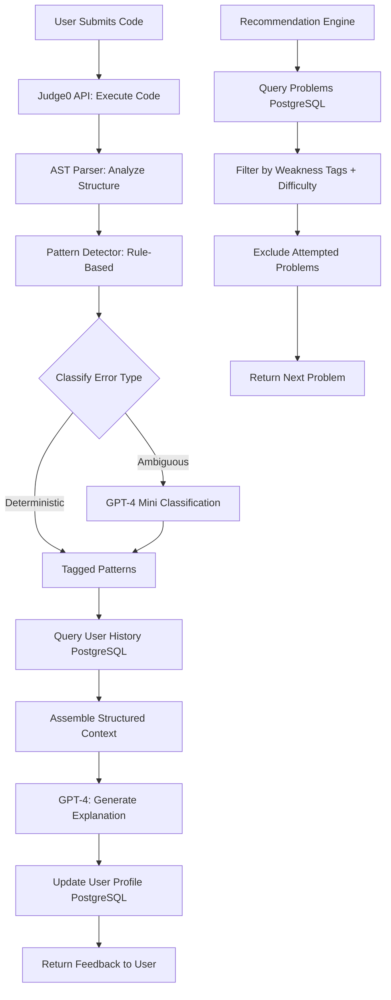

# RAG Strategy for CodeMentor AI

**Team Name:** AI4ce  
**Project:** CodeMentor AI  
**Date:** November 3, 2025

---

## 1. Do We Need RAG?

**Decision:** ☐ YES, we're using RAG  |  ☑ NO, we're not using RAG

**Reasoning:**

CodeMentor AI does not require RAG because:

1. **No document corpus to search**: We don't have policy documents, manuals, or knowledge bases that need retrieval
2. **Structured data in relational database**: Problem statements, test cases, and user submissions are stored in PostgreSQL with direct SQL queries
3. **Real-time code analysis**: AST parsing and pattern detection operate on submitted code, not historical documents
4. **Generated explanations**: GPT-4 generates educational feedback based on current submission context, not retrieved examples
5. **Deterministic problem selection**: Recommendation engine uses algorithmic filtering on tagged problems, not semantic similarity search

**Our approach instead:**
- Direct SQL queries for user history and problem metadata
- In-memory AST analysis for submitted code
- Prompt engineering with structured context (problem + code + detected patterns)
- No need for vector embeddings or similarity search

---

## 2. Alternative Data Access Architecture

### Option D: Direct Database + Function Calling

```
User Submits Code → Execute in Sandbox → AST Analysis → 
Pattern Detection (Rule-Based + GPT-4) → SQL Query (User History) → 
Recommendation Algorithm → Augment Prompt with Structured Data → 
GPT-4 Generates Explanation → Response
```

### Why This Is Better for Our Project

**1. Data is inherently structured:**
- Problems have metadata: difficulty, tags, optimal complexity
- User attempts: timestamp, code, error patterns, test results
- SQL queries are faster and cheaper than vector search

**2. No semantic search needed:**
- Problem recommendation uses categorical tags (e.g., "edge-case-errors", "time-complexity")
- Filtering by tags + difficulty level is deterministic
- Example: "Find problems tagged 'hash-map' AND difficulty='medium' AND NOT attempted_by_user"

**3. Real-time analysis, not retrieval:**
- Each code submission is analyzed fresh (AST + test execution)
- We're not searching for "similar past submissions"
- Pattern detection is rule-based + ML classification on current code

**4. Cost and latency:**
- SQL query: <50ms, essentially free
- Vector search: 100-200ms, costs per query
- We need fast feedback loops for coding practice

**5. Context is always current:**
- User's weakness profile updates after each submission
- No stale embeddings to refresh
- Problem metadata rarely changes (no re-indexing needed)

---

## 3. Data Sources

### Primary Data Sources

**Source 1: Problem Bank**
- **Type:** PostgreSQL table `problems`
- **Location:** Main database
- **Quantity:** 50 problems (MVP), expandable to 500+
- **Update Frequency:** Monthly (new problems added)
- **Schema:**
  ```sql
  problems (
    id, title, description, difficulty,
    optimal_time_complexity, optimal_space_complexity,
    error_pattern_tags[],  -- e.g., ['edge-cases', 'hash-map-optimal']
    prerequisite_problem_ids[]
  )
  ```

**Source 2: User Submission History**
- **Type:** PostgreSQL table `submissions`
- **Location:** Main database
- **Quantity:** ~100-1000 per user (grows over time)
- **Update Frequency:** Real-time (after each submission)
- **Schema:**
  ```sql
  submissions (
    id, user_id, problem_id, code, language,
    test_results, detected_patterns[],
    time_complexity_detected, timestamp
  )
  ```

**Source 3: User Weakness Profile**
- **Type:** PostgreSQL table `user_profiles`
- **Location:** Main database
- **Quantity:** 1 per user
- **Update Frequency:** Real-time (after each submission)
- **Schema:**
  ```sql
  user_profiles (
    user_id,
    weakness_scores JSONB,  -- {'edge-cases': 45, 'time-complexity': 72, ...}
    mastery_level,
    interview_readiness_score,
    last_updated
  )
  ```

**Source 4: Code Execution Results**
- **Type:** Judge0 API (external service)
- **Location:** https://judge0.com
- **Update Frequency:** Real-time per submission
- **Returns:** stdout, stderr, execution time, memory usage, test pass/fail

---

## 4. Technical Implementation

### Direct Database Queries

**User History Retrieval:**
```python
# Get last 10 submissions for pattern analysis
query = """
SELECT problem_id, detected_patterns, test_results
FROM submissions
WHERE user_id = $1
ORDER BY timestamp DESC
LIMIT 10
"""
```

**Problem Recommendation Query:**
```python
# Find problems targeting user's weakest areas
query = """
SELECT * FROM problems
WHERE difficulty = $1
  AND error_pattern_tags && $2  -- Array overlap operator
  AND id NOT IN (
    SELECT problem_id FROM submissions WHERE user_id = $3
  )
ORDER BY RANDOM()
LIMIT 5
"""
# $1 = difficulty level (based on user mastery)
# $2 = weak pattern tags from user profile
# $3 = user_id
```

### GPT-4 Prompt Augmentation

Instead of RAG retrieval, we construct prompts with structured data:

```python
prompt = f"""
You are CodeMentor AI. Analyze this code submission and provide educational feedback.

PROBLEM:
{problem.description}
Optimal Complexity: {problem.optimal_time_complexity}

USER'S CODE:
{submission.code}

DETECTED ISSUES:
- Time Complexity: {ast_analysis.detected_complexity}
- Patterns: {detected_patterns}  # e.g., ['missing-edge-case', 'suboptimal-data-structure']

USER'S HISTORY (Last 5 Problems):
{recent_pattern_summary}  # e.g., "User frequently misses null checks (4/5 problems)"

INSTRUCTIONS:
1. Explain what went wrong in this specific submission
2. Connect to broader CS concepts (why this pattern matters)
3. Reference their history (e.g., "You've struggled with edge cases before")
4. Suggest concrete improvement steps
5. Keep tone encouraging, not discouraging

Do not provide the solution code. Focus on teaching the thought process.
"""
```

### Context Assembly Pattern

```python
def generate_feedback(submission: Submission, user: User):
    # 1. Execute code (Judge0 API call)
    test_results = execute_code(submission.code)
    
    # 2. Analyze code structure (local AST parsing)
    ast_analysis = analyze_ast(submission.code)
    
    # 3. Detect patterns (rule-based + GPT-4 classification)
    patterns = detect_error_patterns(ast_analysis, test_results)
    
    # 4. Query user history (SQL)
    recent_attempts = db.query(
        "SELECT * FROM submissions WHERE user_id=$1 ORDER BY timestamp DESC LIMIT 5",
        user.id
    )
    
    # 5. Get problem metadata (SQL)
    problem = db.query("SELECT * FROM problems WHERE id=$1", submission.problem_id)
    
    # 6. Assemble structured context
    context = {
        "problem": problem,
        "code": submission.code,
        "test_results": test_results,
        "detected_patterns": patterns,
        "user_history": summarize_recent_attempts(recent_attempts),
        "weakness_profile": user.weakness_scores
    }
    
    # 7. Generate explanation (GPT-4 with structured prompt)
    explanation = generate_explanation_with_llm(context)
    
    # 8. Update user profile (SQL)
    update_weakness_profile(user.id, patterns)
    
    return explanation
```

---

## 5. Why Not Vector Embeddings?

### Scenarios Where Vector Search Would Be Considered

**Scenario 1: "Find similar past solutions"**
- Could embed all user solutions and search for similar approaches
- **Why we're not doing this:** Not needed for feedback generation. We analyze current code directly.

**Scenario 2: "Semantic problem search"**
- User asks "show me problems about trees and recursion"
- Could embed problem descriptions and search semantically
- **Why we're not doing this:** Problems are pre-tagged with structured metadata. Tag-based filtering is more precise.

**Scenario 3: "Search error explanations database"**
- Maintain database of past explanations and retrieve similar ones
- **Why we're not doing this:** GPT-4 generates fresh explanations. Caching is based on exact pattern match, not similarity.

### When We Might Add RAG (Future Iterations)

**Post-MVP Enhancement:**
If we build a "community solutions" feature where users can browse others' approaches:
- Embed all accepted solutions
- Enable semantic search: "Show me creative solutions to this problem"
- Use vector similarity to find novel approaches

**For now:** Keep it simple. Direct queries and structured prompts are sufficient.

---

## 6. Caching Strategy (Alternative to Vector DB)

Since we're not using RAG, we use traditional caching:

### Response Caching
```python
# Cache GPT-4 explanations for common patterns
cache_key = f"{problem_id}:{detected_patterns}:{language}"

if cached_explanation := redis.get(cache_key):
    return cached_explanation

# Generate new explanation
explanation = generate_with_gpt4(context)
redis.set(cache_key, explanation, ttl=7_days)
```

### Pre-computed Metadata
```python
# Pre-calculate problem difficulty metrics
problems_cache = {
    problem.id: {
        "avg_solve_time": ...,
        "success_rate": ...,
        "common_mistakes": [...]
    }
}
# Updated daily via cron job
```

---

## 7. Implementation Timeline

- **Week 5:** Database schema design, seed 15 problems with metadata
- **Week 6:** Implement code execution + AST analysis pipeline
- **Week 7:** Build rule-based pattern detection (no ML yet)
- **Week 8:** Integrate GPT-4 for explanation generation with structured prompts
- **Week 9:** Implement recommendation algorithm (SQL-based filtering)
- **Week 10:** Add GPT-4 pattern classification, refine prompt engineering
- **Week 11:** Build user profile tracking, weakness score calculations
- **Week 12:** Optimize query performance, add caching
- **Week 13:** Final testing, polish feedback quality

---

## 8. Risks and Mitigations

### Risk 1: GPT-4 Hallucinations in Explanations
**Symptom:** AI invents incorrect complexity analysis or suggests wrong approaches

**Mitigation:**
- Provide ground truth data in prompt (optimal solution complexity from DB)
- Structured output format with required fields
- Validation: Check that cited patterns match detected patterns
- Fallback: Template-based explanations for common patterns

### Risk 2: Database Query Performance
**Symptom:** Slow recommendation queries as submission history grows

**Mitigation:**
- Index on `(user_id, timestamp)` for recent attempts
- Index on `error_pattern_tags` for recommendation queries
- Limit history lookups to last 20 submissions
- Consider materialized view for user weakness scores

### Risk 3: High GPT-4 Costs
**Symptom:** $0.10+ per feedback generation

**Mitigation:**
- Cache explanations by pattern combination (estimated 70% cache hit rate)
- Use GPT-4o-mini for pattern classification ($0.15 vs $5 per 1M tokens)
- Reserve GPT-4 only for final explanation generation
- Implement daily spending limits

### Risk 4: Judge0 API Downtime
**Symptom:** Cannot execute code submissions

**Mitigation:**
- Implement retry logic with exponential backoff
- Fallback to local Python subprocess sandbox for Python-only (unsafe, disabled by default)
- Queue submissions during downtime, process when service returns
- Clear error message to user with ETA

---

## 9. Data Flow Diagram



---

## 10. Comparison: RAG vs Our Approach

| Aspect | Traditional RAG | Our Direct Query Approach |
|--------|----------------|---------------------------|
| **Data Type** | Unstructured documents | Structured DB tables |
| **Retrieval Method** | Vector similarity search | SQL queries with filters |
| **Latency** | 150-300ms | 20-50ms |
| **Cost per Query** | $0.001 (embedding) + $0.0001 (vector search) | ~$0 (SQL) |
| **Maintenance** | Re-embed when docs change | Update DB rows directly |
| **Precision** | Semantic similarity (fuzzy) | Exact match on tags (precise) |
| **Best For** | "Find documents about X" | "Get problems where tag IN [...]" |

**Conclusion:** Our structured data and query patterns don't benefit from vector search. Direct SQL is faster, cheaper, and more accurate for our use case.

---

**Date Completed:** November 3, 2025

**Key Takeaway:** Not every AI project needs RAG. CodeMentor AI's strength is real-time code analysis with structured data queries, not document retrieval.